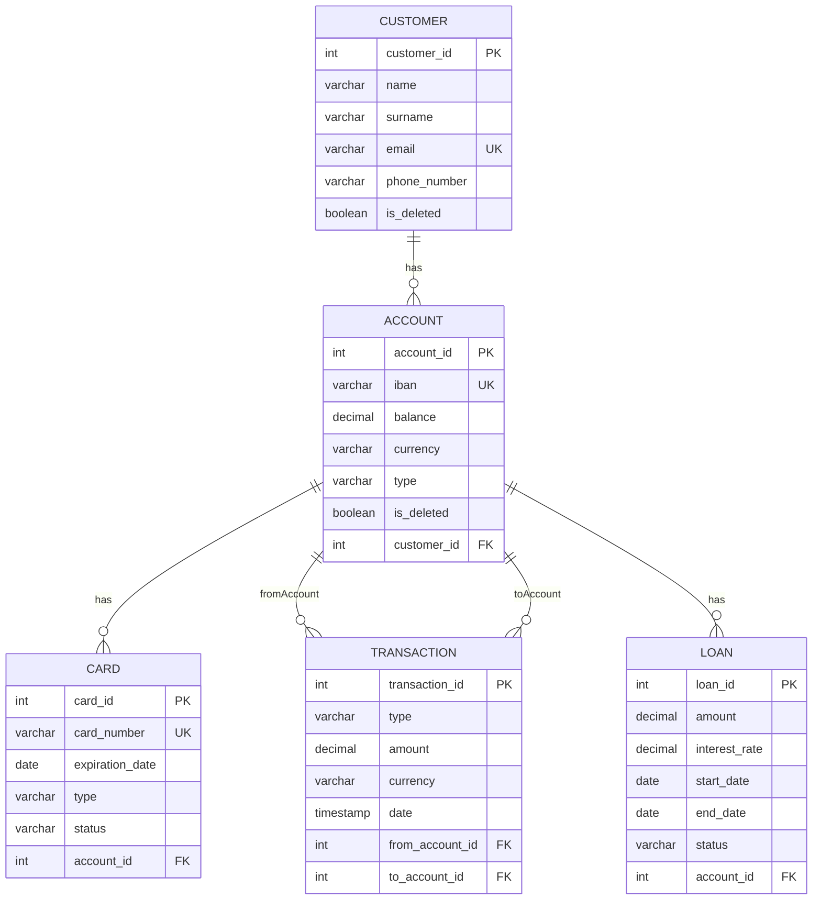

# Схема бази даних (Database Schema)

## Загальний опис

База даних проєкту **Bank System** призначена для зберігання інформації про клієнтів банку, їхні рахунки, картки, кредити та фінансові транзакції.

Схема спроєктована відповідно до вимог **третьої нормальної форми (3НФ)**:
- відсутнє дублювання даних
- всі неключові поля залежать тільки від первинного ключа
- звʼязки між сутностями реалізовані через зовнішні ключі

Також у системі використовується **soft delete** для клієнтів і рахунків, що дозволяє зберігати історичні дані для аналітики.

---

## ER-діаграма

## Таблиця `customer`

**Призначення:**  
Зберігає інформацію про клієнтів банку.

| Стовпець | Тип даних | Обмеження | Опис |
|--------|----------|----------|------|
| customer_id | SERIAL | PRIMARY KEY | Унікальний ідентифікатор клієнта |
| name | VARCHAR(32) | NOT NULL | Ім’я клієнта |
| surname | VARCHAR(32) | NOT NULL | Прізвище клієнта |
| email | VARCHAR(64) | NOT NULL, UNIQUE | Email клієнта |
| phone_number | VARCHAR(20) | NOT NULL | Номер телефону |
| is_deleted | BOOLEAN | DEFAULT FALSE | Ознака м’якого видалення |

**Зв’язки:**
- Один клієнт може мати декілька рахунків

---

## Таблиця `account`

**Призначення:**  
Зберігає інформацію про банківські рахунки клієнтів.

| Стовпець | Тип даних | Обмеження | Опис |
|--------|----------|----------|------|
| account_id | SERIAL | PRIMARY KEY | Унікальний ідентифікатор рахунку |
| iban | VARCHAR(34) | NOT NULL, UNIQUE | IBAN рахунку |
| balance | DECIMAL(12,2) | NOT NULL | Поточний баланс |
| currency | VARCHAR(3) | NOT NULL | Валюта рахунку |
| type | VARCHAR(20) | NOT NULL, CHECK | Тип рахунку (SAVING, CREDIT, DEPOSIT) |
| customer_id | INT | FOREIGN KEY | Посилання на клієнта |
| is_deleted | BOOLEAN | DEFAULT FALSE | Ознака м’якого видалення |

**Зв’язки:**
- Багато рахунків належать одному клієнту
- Один рахунок може мати картки, транзакції та кредити

---

## Таблиця `card`

**Призначення:**  
Зберігає інформацію про банківські картки.

| Стовпець | Тип даних | Обмеження | Опис |
|--------|----------|----------|------|
| card_id | SERIAL | PRIMARY KEY | Ідентифікатор картки |
| card_number | VARCHAR(16) | NOT NULL, UNIQUE | Номер картки |
| expiration_date | DATE | NOT NULL | Термін дії |
| type | VARCHAR(20) | NOT NULL | Тип картки (DEBIT, CREDIT) |
| status | VARCHAR(20) | NOT NULL | Статус картки (ACTIVE, BLOCKED, CLOSED) |
| account_id | INT | FOREIGN KEY | Посилання на рахунок |

**Зв’язки:**
- Картка належить одному рахунку

---

## Таблиця `transactions`

**Призначення:**  
Зберігає інформацію про фінансові транзакції.

| Стовпець | Тип даних | Обмеження | Опис |
|--------|----------|----------|------|
| transaction_id | SERIAL | PRIMARY KEY | Ідентифікатор транзакції |
| type | VARCHAR(20) | NOT NULL | Тип транзакції (DEPOSIT, TRANSFER, WITHDRAW) |
| currency | VARCHAR(3) | NOT NULL | Валюта транзакції |
| amount | DECIMAL(12,2) | NOT NULL, CHECK (amount > 0) | Сума транзакції |
| date | TIMESTAMP | DEFAULT CURRENT_TIMESTAMP | Дата та час |
| description | VARCHAR(255) | NULL | Опис транзакції |
| from_account_id | INT | FOREIGN KEY | Рахунок списання |
| to_account_id | INT | FOREIGN KEY | Рахунок зарахування |

**Зв’язки:**
- Транзакція пов’язана з одним або двома рахунками

---

## Таблиця `loan`

**Призначення:**  
Зберігає інформацію про кредити клієнтів.

| Стовпець | Тип даних | Обмеження | Опис |
|--------|----------|----------|------|
| loan_id | SERIAL | PRIMARY KEY | Ідентифікатор кредиту |
| amount | DECIMAL(12,2) | NOT NULL | Сума кредиту |
| interest_rate | DECIMAL(5,2) | CHECK (0 <= interest_rate <= 100) | Відсоткова ставка |
| start_date | DATE | NOT NULL | Дата початку |
| end_date | DATE | NOT NULL | Дата завершення |
| status | VARCHAR(20) | NOT NULL | Статус кредиту |
| account_id | INT | FOREIGN KEY | Рахунок, до якого прив’язаний кредит |

**Зв’язки:**
- Один рахунок може мати декілька кредитів

## Індексація

Для підвищення продуктивності в базі даних використовуються:
- унікальні індекси на `email`, `iban`, `card_number`
- індекси на зовнішні ключі (`customer_id`, `account_id`)