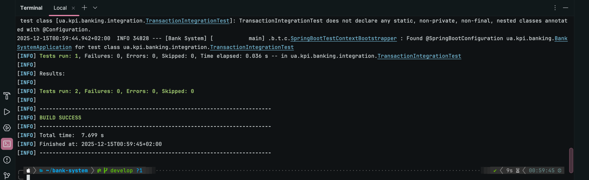
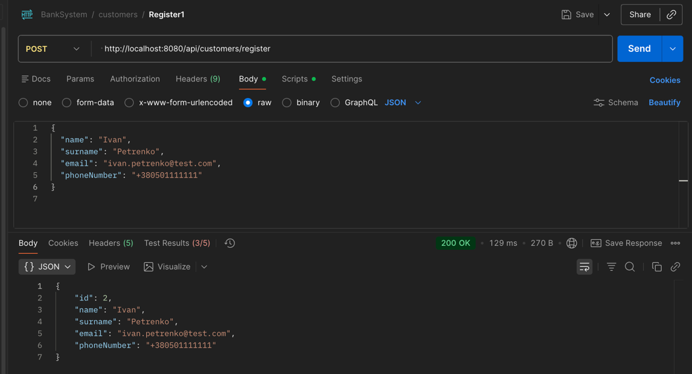
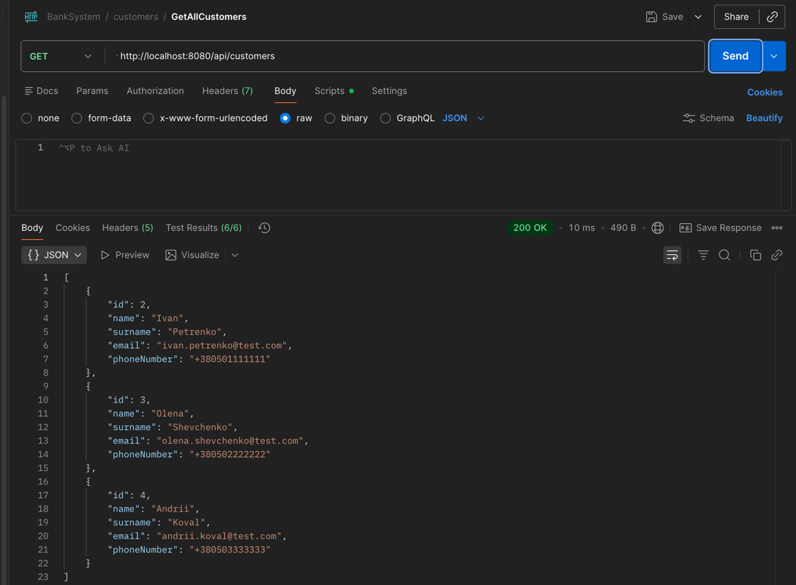
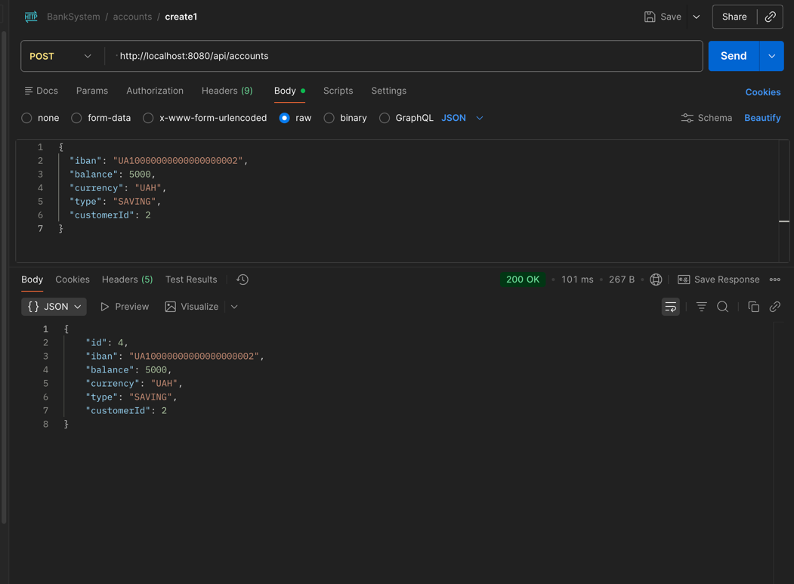
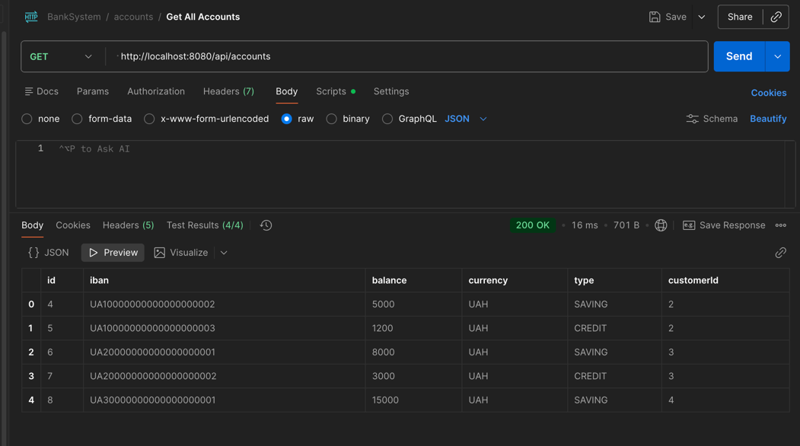
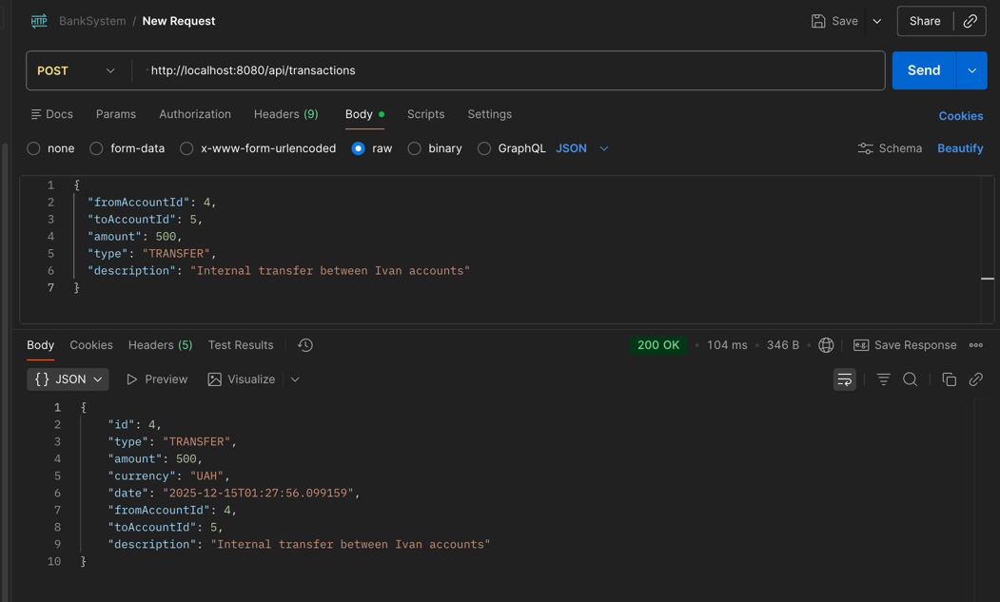
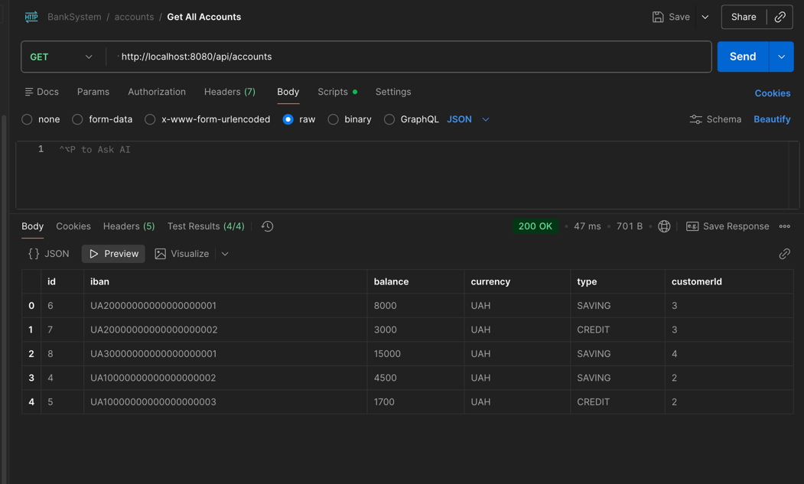
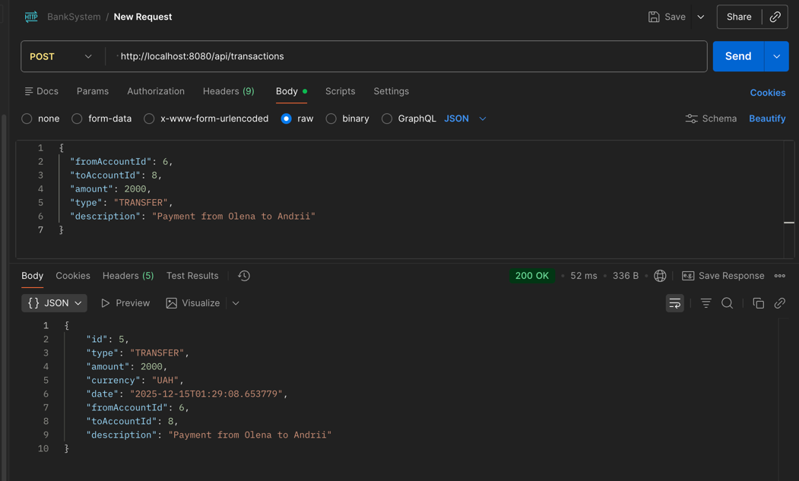
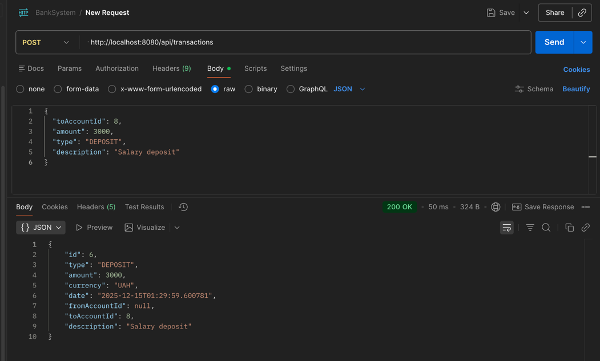
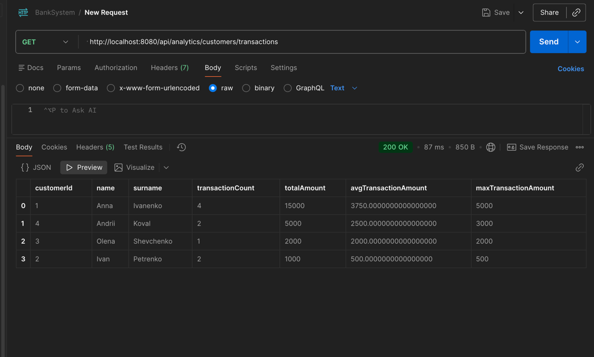

# Тестування

## Загальний підхід до тестування

У проєкті **Bank System** використано два підходи до тестування:

1. **Інтеграційні тести (JUnit + Spring Boot)**  
   Для перевірки бізнес-логіки та коректної роботи з базою даних.
2. **API-тестування (Postman)**  
   Для перевірки REST API та демонстрації роботи ендпоінтів.

Такий підхід дозволяє перевірити як внутрішню логіку системи, так і її зовнішній інтерфейс.

---

## Інтеграційні тести

Інтеграційні тести реалізовані з використанням:

- Spring Boot Test
- JUnit 5
- H2 / PostgreSQL test profile
- @Transactional для автоматичного rollback після кожного тесту

### Реалізовані тести

- створення клієнта
- створення рахунків клієнта
- виконання транзакції між рахунками
- перевірка коректного оновлення балансу
- перевірка транзакційності (усі операції виконуються атомарно)

### Приклад тесту

```java
@SpringBootTest
@ActiveProfiles("test")
@Transactional
class TransactionIntegrationTest {

    @Autowired
    CustomerService customerService;

    @Autowired
    AccountService accountService;

    @Autowired
    TransactionService transactionService;

    @Test
    void shouldTransferMoneyBetweenAccounts() {

        CreateCustomerRequest customerRequest = new CreateCustomerRequest();
        customerRequest.setName("Ivan");
        customerRequest.setSurname("Petrenko");
        customerRequest.setEmail("ivan@test.com");
        customerRequest.setPhoneNumber("+380000000");

        var customer = customerService.createCustomer(customerRequest);

        CreateAccountRequest fromReq = new CreateAccountRequest();
        fromReq.setIban("UA111");
        fromReq.setBalance(BigDecimal.valueOf(1000));
        fromReq.setCurrency("UAH");
        fromReq.setType(AccountType.SAVING);
        fromReq.setCustomerId(customer.getId());

        var fromAccount = accountService.createAccount(fromReq);

        CreateAccountRequest toReq = new CreateAccountRequest();
        toReq.setIban("UA222");
        toReq.setBalance(BigDecimal.ZERO);
        toReq.setCurrency("UAH");
        toReq.setType(AccountType.SAVING);
        toReq.setCustomerId(customer.getId());

        var toAccount = accountService.createAccount(toReq);

        CreateTransactionRequest tx = new CreateTransactionRequest();
        tx.setFromAccountId(fromAccount.getId());
        tx.setToAccountId(toAccount.getId());
        tx.setAmount(BigDecimal.valueOf(300));
        tx.setType(TransactionType.TRANSFER);
        tx.setDescription("Test transfer");

        transactionService.createTransaction(tx);

        var updatedFrom = accountService.findById(fromAccount.getId());
        var updatedTo = accountService.findById(toAccount.getId());

        assertEquals(BigDecimal.valueOf(700), updatedFrom.getBalance());
        assertEquals(BigDecimal.valueOf(300), updatedTo.getBalance());
    }
}
```

---

### Перевірка транзакційності та rollback

Інтеграційні тести виконуються з використанням анотації `@Transactional`.

Це означає, що:
- кожен тест запускається в окремій транзакції
- після завершення тесту транзакція автоматично відкочується
- база даних залишається в початковому стані

Таким чином перевіряється:
- атомарність операцій
- відсутність часткових змін у разі помилок
- коректна робота транзакцій у сервісному шарі

---

## API-тестування (Postman)

Для перевірки REST API використано Postman.

API-тестування застосовується для:
- створення клієнтів
- створення рахунків
- виконання транзакцій
- отримання аналітичних даних

### Перевіряються:
- HTTP-статуси відповідей
- структура JSON-відповідей
- наявність обовʼязкових полів
- базова валідація даних
- час відповіді сервера

### Приклад Postman-тесту

```javascript
pm.test("Response status code is 200", function () {
    pm.expect(pm.response.code).to.equal(200);
});

pm.test("Response is an array", function () {
    const responseData = pm.response.json();
    pm.expect(responseData).to.be.an('array');
}); 
```
---

## Скріншоти тестування

Для демонстрації коректної роботи системи використано скріншоти:

- успішного виконання інтеграційних тестів (`mvn test`)
  
- виконання API-запитів у Postman










- результатів аналітичних запитів

Скріншоти збережені у директорії: docs/screenshots/

## Висновок

Інтеграційні та API-тести підтверджують:
- коректність бізнес-логіки
- правильну роботу транзакцій
- цілісність даних у базі
- стабільність REST API